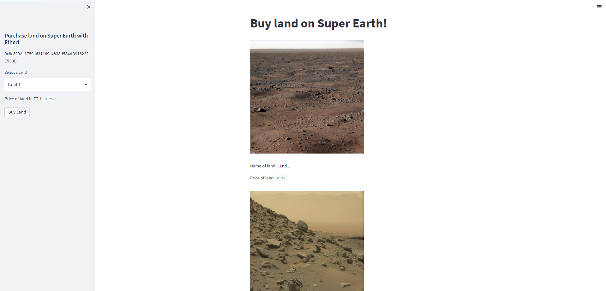
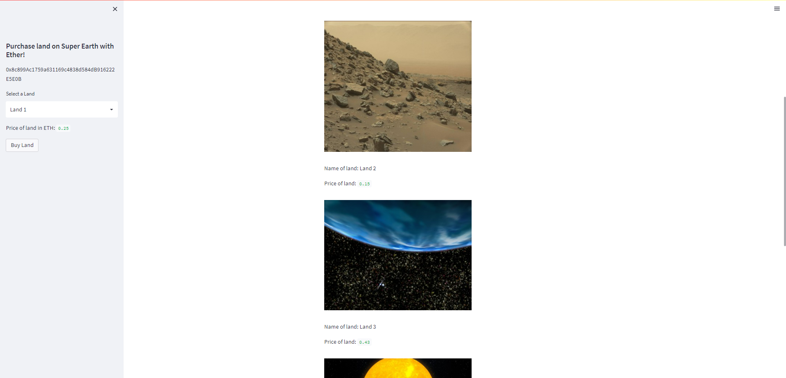
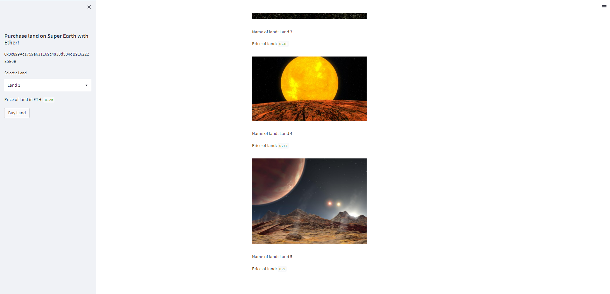

# project3_fintech

Develop a project that utilizes blockchain technology. 

Initial Ideas:
 1. For clients to purchase land on the new super earth planet discovered recently via Ethereum token.
 
 2. To be able to register and update the star land registry dApp, pin an star land File to IPFS via Pinata.
 
 3. All property NFT contracts are encrypted and tokenized on Solidity Remix IDE.

The class presentation is located here: [New Earth Found - LP 890-9c.pdf](https://github.com/Loudju/project3_fintech/files/9641826/New.Earth.Found.-.LP.890-9c.pdf)

---
## Top Offerings

---

## Technologies

This project uses Solidity, Remix IDE, Git Bash, Visual Studio, and Github.

---

## Installation Guide

The web version of Remix IDE was used and this is the Solidity version that was used:

    pragma solidity ^0.5.0

Imports and libraries:

    import streamlit as st

    from dataclasses import dataclass

    from typing import Any, List

    from web3 import Web3

    w3 = Web3(Web3.HTTPProvider('HTTP://127.0.0.1:7545'))

    from wallet import generate_account, get_balance, send_transaction

    import os

    import requests

    from dotenv import load_dotenv

    load_dotenv()

    from bip44 import Wallet

    from web3 import Account

    from web3 import middleware

    from web3.gas_strategies.time_based import medium_gas_price_strategy

---

## Usage

* Step 1: 

* Step 2: 

* Step 3: 

---

## Streamlit Snippets

## Star Land Registry & Appraisal System with IPFS

## Instructions
  1. Deploy the Contract

  2. Prepare the environment
  
 
 
  3. Build the dApp
  
### Reister New Star Land:

### Appraise Star Land and Get Transaction History:

---

## Contributors

Allyssa Carmin

Vicky Lee

Julian Louden

Noman Zubairi

---

## License

SMU Fintech Course, Project 3
