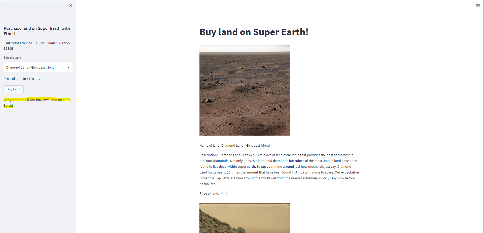

# project3_fintech

Develop a project that utilizes blockchain technology. 

Initial Ideas:
 1. For clients to purchase land on the new super earth planet discovered recently via Ethereum token.
 
 2. To be able to register and update the star land registry dApp, pin an star land File to IPFS via Pinata.
 
 3. All property NFT contracts are encrypted and tokenized on Solidity Remix IDE.

The class presentation is located here: [New Earth Found - LP 890-9c.pdf](https://github.com/Loudju/project3_fintech/files/9641826/New.Earth.Found.-.LP.890-9c.pdf)

---
## Top Offerings on the Super-Earth

 - Land 1-Diamond Land “Girls best friend”
 

Diamond Land is an exquisite piece of land ownership that provides the best of the best in precious diamonds. Not only does this land hold diamonds but rubies of the most unique kind have been found to live deep within super earth. To rap your mind around just how much, lets just say, Diamond Land holds nearly 10 times the amount that have been found in Africa with more to spare. Our expectation is that the Top Jewelers from around the world will flood the market extremely quickly. Buy Now before its too late.

 - Land2- Oil & Gas Land
 

While Gas prices are soaring and people around this planet are going crazy, Super Earth has an abundance of Oil and Gas landfills that would make  the Saudi Arabian Supply look miniscule. This will not last long. As this is by far one of the most sought after types of Land on this planet and beyond. Super Earth will literaly fuel this planet. Be apart of saving planet earth today. Buy now.

 - Land3- Waterloo “Infinite water spring rights”
 

As you may know, water is at a drought on planet earth and resources are becoming more limited by the day. Buy land on Super Earth now, where your investment will last many light years beyond planet earth. With fresh spring water rights the possibilities are near infitie on how you could benefit humanity or commercialize your rights as you see fit.

 - Land-4 Gold Heaven
 

Own the rights to your own gold heaven with these special out of this world land rights. As you may know gold is not just a commodity but very important when building the very technology that we use daily from phones to laptops. Gold has backed the dollar at one point and now the availability is beyond what the government can control. Own your own gold heaven today and the possibility to fund the money supply of the future. The possibilities are endless with this purchase as Gold is thee super conductor for Life.

 - Land5- Ti22 “Titanium Overload”
 

Titanium is one of the strongest metals known to man and has been the bedrock of our defense departments weapon supply and the ability to build innovative technologies with many use cases. Do not hesitate to buy, as this land is sought after by all of the top governmental powers on earth such as The United States, China, Russia, Saudi, and more. With your purchase you could control innovation for centuries to come.

---

## Technologies

This project uses Solidity, Remix IDE, Git Bash, Visual Studio, and Github.

---

## Installation Guide

The web version of Remix IDE was used and this is the Solidity version that was used:

    pragma solidity ^0.5.0

Imports and libraries:

    import streamlit as st

    from dataclasses import dataclass

    from typing import Any, List

    from web3 import Web3

    w3 = Web3(Web3.HTTPProvider('HTTP://127.0.0.1:7545'))

    from wallet import generate_account, get_balance, send_transaction

    import os

    import requests

    from dotenv import load_dotenv

    load_dotenv()

    from bip44 import Wallet

    from web3 import Account

    from web3 import middleware

    from web3.gas_strategies.time_based import medium_gas_price_strategy

---

## Streamlit Snippets

## Star Land Registry & Appraisal System with IPFS

## Instructions
  1. Deploy the Contract

  2. Prepare the environment
  
 
 
  3. Build the dApp
  
### Reister New Star Land:

### Appraise Star Land and Get Transaction History:

---

## Contributors

Allyssa Carmin

Vicky Lee

Julian Louden

Noman Zubairi

---

## License

SMU Fintech Course, Project 3
